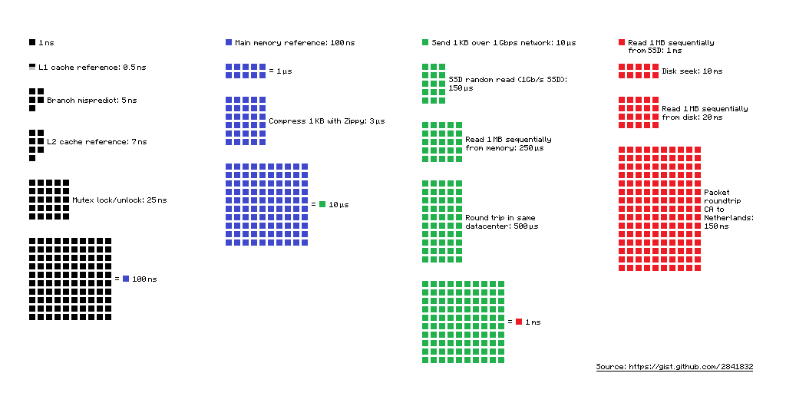
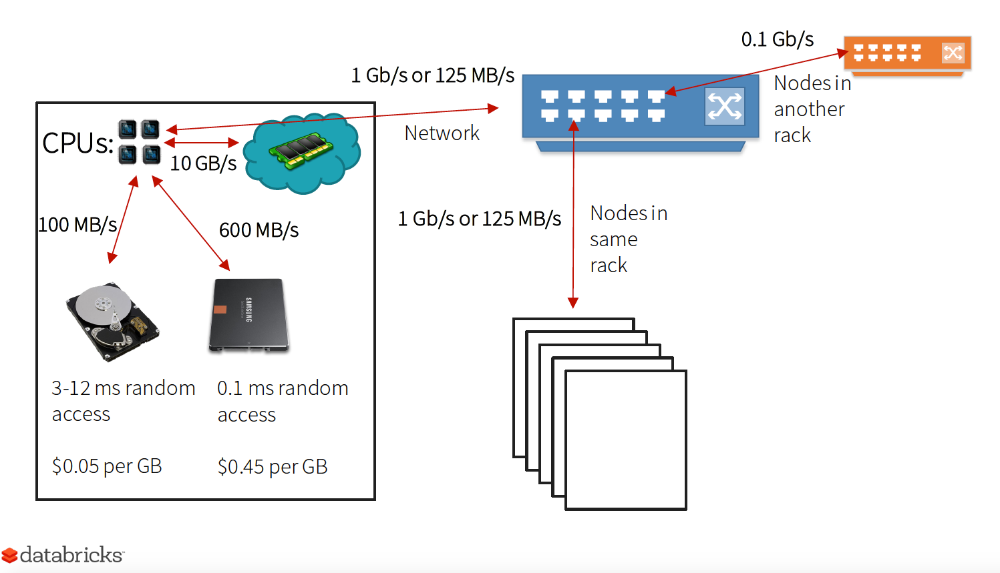
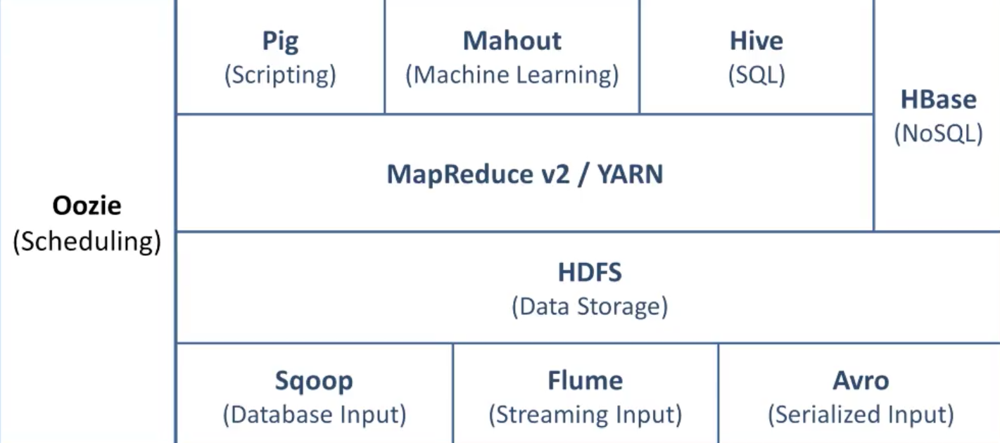
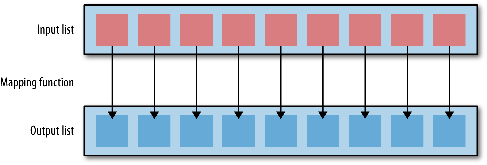
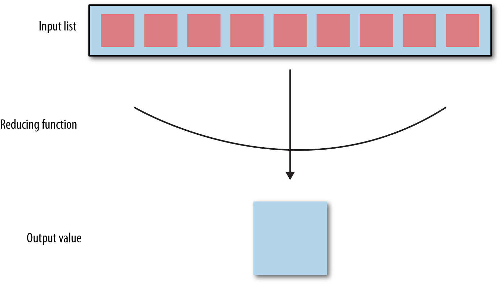
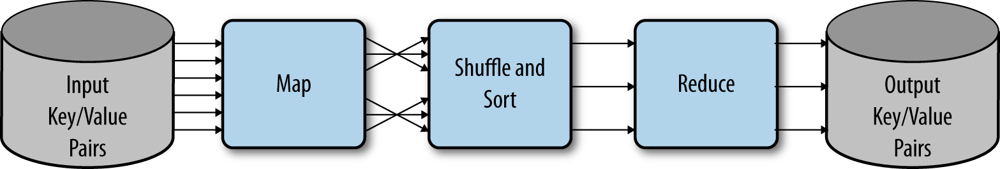
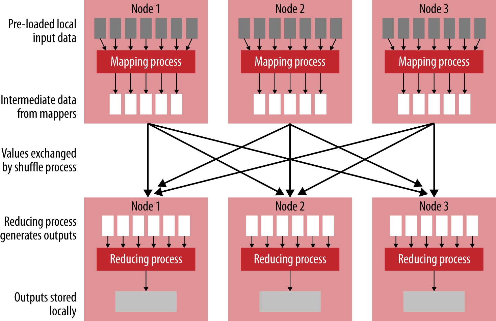
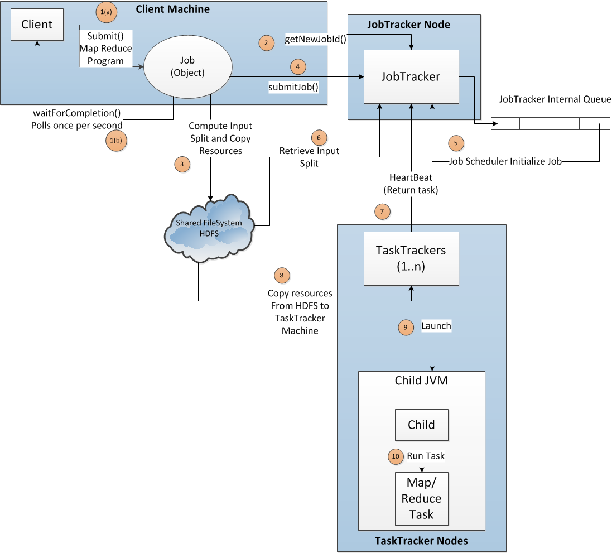

autoscale: true


#[fit] Data Engineering - Part I

---

## Why renewed interest in data


- Individual’s data footprint is growing (non linear)
- Amount of data generated by machines also growing

> 90% of world's data created in the last 2 to three years

---

#[fit] Defining Big Data

---


Big Data - A very subjective term 

__Volume__ : Large volumes clearly define Big Data. Size of the data makes it impossible to be processed by  conventional means

__Variety__ : Data may come from a variety of sources and not necessarily be “related” to other

__Velocity__: Refers to how fast the data can be generated and processed


> A big data-processing system will have to deal with any combination of the above 3Vs.  

__Veracity__: Refers to the correctness and accuracy problems associated with big datasets


---

# Why Hadoop?

---

- Limitations of RDBMS systems

- Limitations of NoSQL systems

- Limitations of Data Warehouse Appliances


---


#Latency numbers every programmer should know

---


---



---

# Evolution of Hadoop 

---


- Google published a paper "Google File System" in October 2003
- This spawned another research paper from Google – MapReduce: Simplified Data Processing on Large Clusters


From 2002 to 2004, Doug Cutting and Mike Cafarella were working on the Nutch project. The goal of the Nutch project was to develop an open source web scale crawler type search engine. Doug Cutting and Mike Cafarella were able to demonstrate that Nutch was able to search 100 million pages on four nodes. 

In 2004, after the publication of the MapReduce white paper, Cutting and Cafarella added a distributed file system (DFS) and MapReduce to Nutch considerably improving its performance 

---

In 2006, Doug Cutting joined Yahoo in a team led by Eric Baldeschweiler.  Eric was in charge of figuring out how to build a next generation search grid computing framework for web searches. 


The new team  created an open source Hadoop Framework based on 

 - __Hadoop Distributed File System__ as its storage system
 - __MapReduce paradigm__ as the parallel computing mode


---

# What is Hadoop ?

---

Apache Hadoop is 
 
 - an open source software platform 
 - for  distributed storage and distributed processing 
 - of very large data sets 
 - on computer clusters built from commodity hardware

---

__Apache Hadoop framework  modules__

- __Hadoop Common__: contains libraries and utilities needed by other Hadoop modules

- __Hadoop Distributed File System (HDFS)__: a distributed file-system that stores data on the commodity machines, providing very high aggregate bandwidth across the cluster

- __Hadoop YARN__: a resource-management platform responsible for managing compute resources in clusters and using them for scheduling of users' applications

- __Hadoop MapReduce__: a programming model for large scale data processing


---

Other Hadoop-related projects at Apache

- __Ambari__: A web-based tool for provisioning, managing, and monitoring Apache Hadoop clusters which includes support for Hadoop HDFS, Hadoop MapReduce, Hive, HCatalog, HBase, ZooKeeper, Oozie, Pig and Sqoop

- __Avro__: A data serialization system

- __Cassandra__: A scalable multi-master database with no single points of failure

- __Chukwa__: A data collection system for managing large distributed systems

- __HBase__: A scalable, distributed database that supports structured data storage for large tables

---

- __Hive__: A data warehouse infrastructure that provides data summarization and ad hoc querying

- __Mahout__: A Scalable machine learning and data mining library

- __Pig__: A high-level data-flow language and execution framework for parallel computation

- __Spark__: A fast and general compute engine for Hadoop data. Spark provides a simple and expressive programming model that supports a wide range of applications, including ETL, machine learning, stream processing, and graph computation

- __Tez__: A generalized data-flow programming framework, built on Hadoop YARN, which provides a powerful and flexible engine to execute an arbitrary DAG of tasks to process data for both batch and interactive use-cases

- __ZooKeeper__: A high-performance coordination service for distributed applications

---


---

# The Hadoop Distributed File System (HDFS)

---

HDFS is essentially 

- a distributed file system designed to hold very large amounts of data (terabytes / petabytes)
- and provide high throughput access to this information

Files are split into blocks and stored in a redundant fashion across multiple computers ensuring their durability to failure and high availability to parallel applications

---

HDFS

- Designed to run on commodity servers with just a bunch of disks (JBOD)
- Designed to minimize seek attempts on disks that are suitable for handling large file sizes
- Has a built-in mechanism to partition and store data on multiple nodes in a redundant fashion
- Has built-in data replication to available nodes when one node fails
- Is a write-once-read-many access model for files that enables high throughput data access


---


HDFS has a master/slave architecture.  An HDFS cluster consists of 

- __NameNode__: a master server that manages the file system namespace and regulates access to files by clients
- __DataNodes__: usually one per node in the cluster, which manages storage attached to the nodes that they run on

HDFS exposes a file system namespace and allows user data to be stored in files. Internally, a file is split into one or more blocks and these blocks are stored in a set of DataNodes.

---


---

 
__NameNode__: 
Executes file system namespace operations like opening, closing, and renaming files and directories. It also determines the mapping of blocks to DataNodes

__DataNodes__:  
Responsible for serving read and write requests from the file system’s clients. The DataNodes also perform block creation, deletion, and replication upon instruction from the NameNode


---

HDFS is built using the Java; any commodity machine that supports Java can run the NameNode or the DataNode 

- Typical deployments have a dedicated machine that runs only the NameNode software
- Each of the other machines in the cluster runs one instance of the DataNode software
- Architecture does not preclude running multiple DataNodes on the same machine but in a real deployment that is rarely the case.


HDFS is designed to process huge volumes of data in an easy to scale out architecture. The choice of a relatively very large block size of 64/128 MB supports this


---
- Every block of data stored on HDFS requires a corresponding entry in the NameNode central metadata directory

- The large block size means that there are fewer entries in the central metadata directory. 

- This speeds up file access when we need to access large files on HDFS

---

HDFS

-  Is a resilient filesystem, which can withstand the failure of a DataNode ( defective hard disk drive, system failure or network failure )

- Keeps multiple copies of the same block on different nodes as a backup to cope with failures

- Uses these backup copies of the block in the event of failure to reconstruct the original file

- Uses a default replication factor of three 

---


---
# HDFS Communication Protocols
---

- All HDFS communication protocols are layered on top of the TCP/IP protocol
- A client establishes a connection to a configurable TCP port on the NameNode machine. It talks the ClientProtocol with the NameNode
- The DataNodes talk to the NameNode using the DataNode Protocol
- A Remote Procedure Call (RPC) abstraction wraps both the Client Protocol and the DataNode Protocol. 

- By design, the NameNode never initiates any RPCs. Instead, it only responds to RPC requests issued by DataNodes or clients

---
# HDFS NameNode (Metadata Manager)

---
- The entire file system namespace, including the mapping of blocks to files and file system properties, is stored in a file called the __FsImage__. 

- The NameNode uses a transaction log called the __EditLog__ to persistently record every change that occurs to file system metadata

---

# HDFS Datanodes

---

- The DataNode stores HDFS data in files in its local file system and has no knowledge about HDFS files. 

- It stores each block of HDFS data in a separate file in its local file system. 

- The DataNode does not create all files in the same directory. Instead, it uses a heuristic to determine the optimal number of files per directory and creates subdirectories appropriately (performance penalty of large number of files in the same folder). 

- When a DataNode starts up, it scans through its local file system, generates a list of all HDFS data blocks that correspond to each of these local files, and sends this report to the NameNode. The report is called the Blockreport.


---

## HDFS - Data Disk Failure, Heartbeats and Re-Replication

---
- DataNode sends a Heartbeat message to the NameNode periodically
- Network partition / failure can cause a subset of DataNodes to lose connectivity with the NameNode
- NameNode detects this condition by the absence of a Heartbeat message and marks DataNodes without recent Heartbeats as dead. It does not forward any new IO requests to them
- Any data that was registered to a dead DataNode is not available to HDFS any more
- The NameNode constantly tracks which blocks need to be replicated and initiates replication whenever necessary
- The NameNode does not send special requests to DataNodes to carry out certain tasks but it uses the replies to heartbeats to send commands to the DataNodes.

---

# HDFS - Data Integrity

---

- It is possible that a block of data fetched from a DataNode arrives corrupted.  (faults in a storage device, network faults, or buggy software)
- The HDFS client software implements checksum validation on the contents of HDFS files
- When a client creates an HDFS file, it computes a checksum of each block of the file and stores these checksums in a separate hidden file in the same HDFS namespace
- When a client retrieves file contents it verifies that the data it received from each DataNode matches the checksum stored in the associated checksum file. If not, then the client can opt to retrieve that block from another DataNode that has a replica of that block

---

# Metadata Disk Failure

---

- A corruption of FsImage and the EditLog can cause the HDFS instance to be non-functional.
- NameNode can be configured to support maintaining multiple copies of the FsImage and EditLog
- Better option is to enable High Availability using multiple NameNodes (Quorum Journal Manager)

---

# HDFS: File Write

---

- An application adds data to HDFS by creating a new file and writing the data to it

- After the file is closed, the bytes written cannot be altered or removed except that new data can be added to the file by reopening the file for append. 
- The HDFS client that opens a file for writing is granted a lease for the file; no other client can write to the file ( HDFS implements a single-writer, multiple-reader model )

- The writing client periodically renews the lease by sending a heartbeat to the NameNode. When the file is closed, the lease is revoked.

- The writer's lease does not prevent other clients from reading the file; a file may have many concurrent readers.

---


- When there is a need for a new block, the NameNode allocates a block with a unique block ID and determines a list of DataNodes to host replicas of the block.

- The DataNodes form a pipeline, the order of which minimizes the total network distance from the client to the last DataNode

- Bytes are pushed to the pipeline as a sequence of packets.

- The number of outstanding packets is limited by the outstanding packets window size of the client.

- HDFS does not provide any guarantee that data are visible to a new reader until the file is closed

- hflush operation immediately pushes the current packet and will wait until all DataNodes in the pipeline acknowledge the successful transmission of the packet

---
# HDFS: File Read

---
- When a client opens a file to read, it fetches the list of blocks and the locations of each block replica from the NameNode. 

- The locations of each block are ordered by their distance from the reader. When reading the content of a block, the client tries the closest replica first. If the read attempt fails, the client tries the next replica in sequence. 

- A read may fail if the target DataNode is unavailable, the node no longer hosts a replica of the block, or the replica is found to be corrupt when checksums are tested.

- HDFS permits a client to read a file that is open for writing. When reading a file open for writing, the length of the last block still being written is unknown to the NameNode. In this case, the client asks one of the replicas for the latest length before starting to read its content.


---


# HDFS setup

---

```
http://arturmkrtchyan.com/how-to-setup-multi-node-hadoop-2-yarn-cluster

```

```bash
#Create a directory on HDFS:
hadoop fs -mkdir /user/hadoop/dir1

#Copy a local file weblog.txt to HDFS:
hadoop fs -put /home/a/weblog.txt /user/hadoop/dir1/

#List an HDFS directory contents:
hadoop fs -ls /user/hadoop/dir1

#Show the space utilization on HDFS:
hadoop fs -du /user/hadoop/dir1

#Copy an HDFS file to a file weblog.txt.1 in the local directory:
hadoop fs -get /user/hadoop/dir1/weblog.txt /home/a/weblog.txt.1

#Get help on HDFS commands:
hadoop fs -help
```

---

# MapReduce

---
MapReduce is a programming model, first, and a set of components, second, that make programming for a distributed system a relatively easier task than all its predecessors.


Has it's origin at Google. Jeff Dean and Sanjay Gemawhat, after going through a couple iterations of rewriting Google’s crawling and indexing systems, started noticing some operations that they could expose through a common interface in 2003

The open source implementation of MapReduce in Hadoop delivers fast performance, not just because of the parallel execution, but also because Hadoop minimizes the expensive movement of data on a network by performing data processing close to where the data is stored

---

- A map function takes as input a series of key/value pairs and operates singly on each individual pair. 
- After performing some analysis or transformation on the input data, the map function may then output zero or more resulting key/value pairs




Typically, the map operation is where the core analysis or processing takes place, as this is the function that sees each individual element in the dataset ( e.g. filter, transformer)

---
Defining map as a new operation on Scala lists

```scala

def map[T](l: List[T])(f: T -> U): List[U] =
  for (i <- l) yield f(i)

```

---

After the map phase, any emitted key/value pairs will then be grouped by key and those key/value groups are applied as input to reduce functions on a per-key basis.



---
Defining reduce operation on Scala lists

```scala

def reduce[T](l: List[T])(neutral: T)(op: (T,T) => T) : T =
  l match {
    case Nil => neutral
    case h :: t =>  reduce(t)(op(neutral, h))(op)
  }
```

---

# MapReduce In A Cluster

---

- Since mappers apply the same function to each element of any arbitrary list of items, they are well suited to distribution across nodes on a cluster

- Each node gets a copy of the mapper operation, and applies the mapper to the key/value pairs that are stored in the blocks of data of the local HDFS data node

- Number of mappers only limited by the number of processors available on the cluster.

- Since they are stateless, no need  for network communication between processes

- Since mappers are deterministic, their output is not dependent on anything but the incoming values, and therefore failed mappers can be reattempted on another node.

---

- Reducers require the output of the mappers as input  on a per-key basis
- Reducer computation can also be distributed - there can be as many reduce operations as the number of keys available from the mapper output
- Each reducer sees all values for a single, unique key
- In order to meet this requirement, a shuffle and sort operation is required to coordinate the map and reduce phases, such that reducer input is grouped and sorted by key
- Reducers then must output zero or more final key/value pairs, which are the output (reducing the results of the map).

---



- Phase 1: Local data is loaded into a mapping process as key/value pairs from HDFS
- Phase 2: Mappers output zero or more key/value pairs, mapping computed values to a particular key
- Phase 3: These pairs are then sorted and shuffled based on the key and are then passed to a reducer such that all values for a key are available to it.

---



---

- In a cluster execution context, a map task is assigned to one or more nodes in the cluster, which contains local blocks of data specified as input to the map operation.

- Blocks are stored in HDFS and and are split into smaller chunks by an InputFormat class, which defines how data is presented to the map applications (e.g. key might be the file identifier and line number and the value might be the string of the line content)

- RecordReader presents each individual key/value pair to the map operation supplied by the user, which then outputs one or more intermediate key/value pairs. 

- A common optimization at this point is to apply a combiner—a process that aggregates map output for a single mapper, similar to how a reducer works, but without full knowledge of the keyspace. This prework leads to less work for the reducers and therefore better reducer performance.

---
- The intermediate keys are pulled from the map processes to a partitioner. 

- The partitioner decides how to allocate the keys to the reducers. Typically, a uniformly distributed keyspace is assumed, and therefore a hash function is used to evenly divide keys among the reducers. 

- The partitioner also sorts the key/value pairs such that the full “shuffle and sort” phase is implemented. 

- Finally, the reducers start work, pulling an iterator of data for each key and performing a reduce operation such as an aggregation. Their output key/value pairs are then written back to HDFS using an OutputFormat class.

---

## MapReduce: Example
---
NCDC weather dataset

https://github.com/tomwhite/hadoop-book/tree/master/input/ncdc/all


```
0067011990999991950051507004...9999999N9+00001+99999999999...
0043011990999991950051512004...9999999N9+00221+99999999999...
0043011990999991950051518004...9999999N9-00111+99999999999...
0043012650999991949032412004...0500001N9+01111+99999999999...
0043012650999991949032418004...0500001N9+00781+99999999999...

```
lines are presented to the map function as the key-value pairs: (keys are the line offsets within the file, which we ignore in our map function)

```
(0, 0067011990999991950051507004...9999999N9+00001+99999999999...)
(106, 0043011990999991950051512004...9999999N9+00221+99999999999...)
(212, 0043011990999991950051518004...9999999N9-00111+99999999999...)
(318, 0043012650999991949032412004...0500001N9+01111+99999999999...)
(424, 0043012650999991949032418004...0500001N9+00781+99999999999...)
```

---


Map function merely extracts the year and the air temperature  and emits them as its output (the temperature values have been interpreted as integers)

```
(1950, 0)
(1950, 22)
(1950, −11)
(1949, 111)
(1949, 78)
```

---

The output from the map function is processed by the MapReduce framework before being sent to the reduce function. This processing sorts and groups the key-value pairs by key

```
(1949, [111, 78])
(1950, [0, 22, −11])
```

---

Each year appears with a list of all its air temperature readings. All the reduce function has to do now is iterate through the list and pick up the maximum reading:

```
(1949, 111)
(1950, 22)
```

----
# Mapper 

----

```java

import java.io.IOException;

import org.apache.hadoop.io.IntWritable;
import org.apache.hadoop.io.LongWritable;
import org.apache.hadoop.io.Text;
import org.apache.hadoop.mapreduce.Mapper;

public class MaxTemperatureMapper
    extends Mapper<LongWritable, Text, Text, IntWritable> {

  private static final int MISSING = 9999;
  
  @Override
  public void map(LongWritable key, Text value, Context context)
      throws IOException, InterruptedException {
    
    String line = value.toString();
    String year = line.substring(15, 19);
    int airTemperature;
    if (line.charAt(87) == '+') { // parseInt doesn't like leading plus signs
      airTemperature = Integer.parseInt(line.substring(88, 92));
    } else {
      airTemperature = Integer.parseInt(line.substring(87, 92));
    }
    String quality = line.substring(92, 93);
    if (airTemperature != MISSING && quality.matches("[01459]")) {
      context.write(new Text(year), new IntWritable(airTemperature));
    }
  }
}

```


---

The map function is represented by the Mapper class, which declares an abstract map() 

The Mapper class is a generic type, with four formal type parameters that specify the input key, input value, output key, and output value types of the map function. 

In the example input key is a long integer offset, the input value is a line of text, the output key is a year, and the output value is an air temperature (an integer). 


> For effectiveness of Hadoop, the serialization/de-serialization process should be optimized because huge number of remote calls happen between the nodes in the cluster. So the serialization format should be fast, compact, extensible and interoperable. Due to this reason, Hadoop framework has come up with one IO classes to replace java primitive data types. e.g. IntWritbale for int, LongWritable for long, Text for String etc


---

## Reducer

---

```java 

import java.io.IOException;

import org.apache.hadoop.io.IntWritable;
import org.apache.hadoop.io.Text;
import org.apache.hadoop.mapreduce.Reducer;

public class MaxTemperatureReducer
    extends Reducer<Text, IntWritable, Text, IntWritable> {
  
  @Override
  public void reduce(Text key, Iterable<IntWritable> values, Context context)
      throws IOException, InterruptedException {
    
    int maxValue = Integer.MIN_VALUE;
    for (IntWritable value : values) {
      maxValue = Math.max(maxValue, value.get());
    }
    context.write(key, new IntWritable(maxValue));
  }
}

```

---


The reduce function is represented by the Reducer class, which declares an abstract reduce() 

The Reducer class is also a generic type, with type params to specify the input and output types

The input types of the reduce function must match the output types of the map function

---

# MapReduce job
---


```java
import org.apache.hadoop.fs.Path;
import org.apache.hadoop.io.IntWritable;
import org.apache.hadoop.io.Text;
import org.apache.hadoop.mapreduce.Job;
import org.apache.hadoop.mapreduce.lib.input.FileInputFormat;
import org.apache.hadoop.mapreduce.lib.output.FileOutputFormat;

public class MaxTemperature {

  public static void main(String[] args) throws Exception {
    if (args.length != 2) {
      System.err.println("Usage: MaxTemperature <input path> <output path>");
      System.exit(-1);
    }
    
    Job job = new Job();
    job.setJarByClass(MaxTemperature.class);
    job.setJobName("Max temperature");

    FileInputFormat.addInputPath(job, new Path(args[0]));
    FileOutputFormat.setOutputPath(job, new Path(args[1]));
    
    job.setMapperClass(MaxTemperatureMapper.class);
    job.setReducerClass(MaxTemperatureReducer.class);

    job.setOutputKeyClass(Text.class);
    job.setOutputValueClass(IntWritable.class);
    
    System.exit(job.waitForCompletion(true) ? 0 : 1);
  }
}

```

---

A Job object forms the specification of the job and gives you control over how the job is run

When we run this job on a Hadoop cluster, we will package the code into a JAR file (which Hadoop will distribute around the cluster)

Rather than explicitly specifying the name of the JAR file, we can pass a class in the Job’s setJarByClass() method, which Hadoop will use to locate the relevant JAR file by looking for the JAR file containing this class

```
% export HADOOP_CLASSPATH=hadoop-examples.jar
% hadoop MaxTemperature input/ncdc/sample.txt output
```


---


- When the hadoop command is invoked with a classname as the first argument, it launches a JVM to run the class. 
- The hadoop command adds the Hadoop libraries (and their dependencies) to the classpath and picks up the Hadoop configuration.
- The hadoop script picks up the environment variable  HADOOP_CLASSPATH which would add the application classes to the classpath.


---


# Hadoop V1

---


__Job Tracker__
Master control process for a Hadoop V1 cluster (usually runs on its own cluster node, but it can be run along with other Hadoop services on the same hardware)

The single Job Tracker schedules, launches, and tracks all MapReduce jobs on the cluster

__Task Tracker__
Nodes where the actual work gets done on the cluster. Each Task Tracker receives work from the Job Tracker and manages sub-jobs on the local cluster node. The sub-job work consists of mapping tasks and then reducing tasks

Task Tracker nodes are often HDFS nodes. Thus, each cluster node provides both computation and storage services
 

---



---

1 - Client submits the job

2 - Job object calls JobTracker class to get a new JobId

3 - Job object checks whether the Input and Output path exists.  Input splits are calculated based on the Input format used.  Split count decides the number of map tasks that will be created by jobtracker for the data. The job jar is copied with a high replication factor

4 - Job object tells JobTracker that job is ready for execution by calling its JobTracker submitJob() function.

5 - JobTracker puts the job on its internal queue and from there a JobScheduler picks it up and initializes it.

---

6 - Based on input split the scheduler will create map tasks. For reduce task it will look at mapred.reduce.tasks property in Job object (set by calling setNumReduceTasks()). JobTracker has info on how many Map Tasks and Reduce tasks are needed to finish the Job

7 - Hadoop works on Pull strategy rather than Push, task trackers send their heartbeat to job tracker periodically which defaults to every 5 seconds. As part of this heartbeat exchange process task tracker will indicate whether it is ready to run a new task. Task trackers have a fixed number of slots for map and reduce tasks and these are set independently. When Job Tracker schedules the tasks it will also acount data locality

8 -  Once Task Tracker receives the tasks it will copy the jar stored on HDFS to its local machine

---

9 - TaskTracker launches a new child JVM to run the task. This is to ensure that issues in child JVM does not cause issue with the Task Tracker process itself

10 - Task is executed

11 - When the job tracker receives a notification that the last task for a job is complete (this
will be the special job cleanup task), it changes the status for the job to “successful”. Signals the waitForCompletion() method in the job and counters are printed to the console


---

# Hadoop V1 Shortcomings

---

Scalability

- The maximum cluster size was about 4000 nodes.
- The maximum number of concurrent tasks was about 40,000 processes.
- JobTracker runs on single machine doing several task like Resource management,  Job and task scheduling and Monitoring thereby limiting scalability

Availability

- Job Tracker failure kills all queued and running jobs.

Resource Utilization

- Fixed or static allocation of resources for map and reduce processes often results in low resource utilization.

---