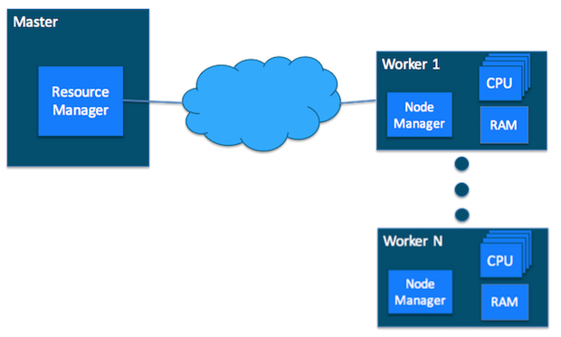
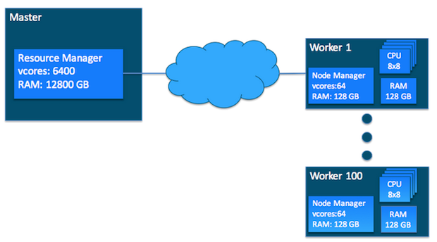
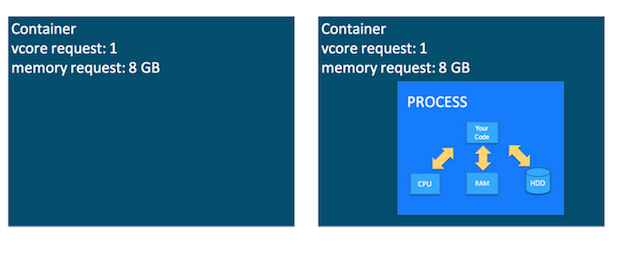

autoscale: true

#[fit] Data Engineering - Part II

---

# BEYOND MAPREDUCE WITH HADOOP V2

---

# Apache YARN 

---

In a YARN cluster, there are two types of hosts:

__ResourceManager__ 

Master daemon that communicates with the client, tracks resources on the cluster, and orchestrates work by assigning tasks to NodeManagers

__NodeManager__ 

Worker daemon that launches and tracks processes spawned on worker hosts.

---

---

YARN  defines two resources 

- __vcores__  - think of it as a “usage share of a CPU core.”
- __memory__

---

# Yarn Containers

---

__container__ : 

A request to hold resources (vcore and memory) on the YARN cluster

Once a hold has been granted on a host, the NodeManager launches a process called a task. 

---

